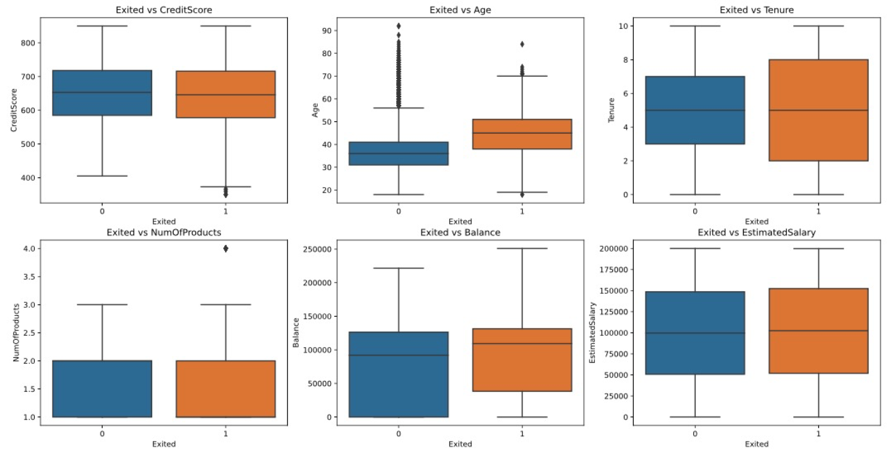
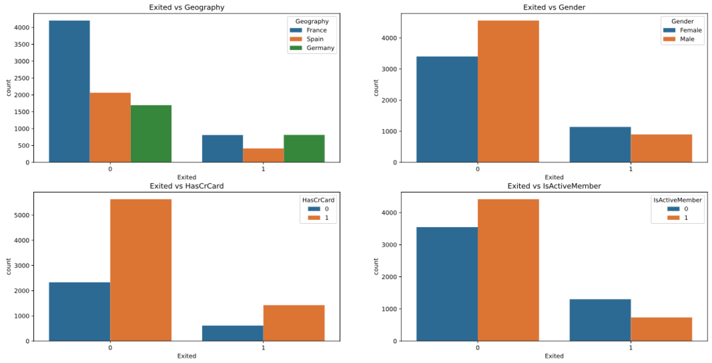
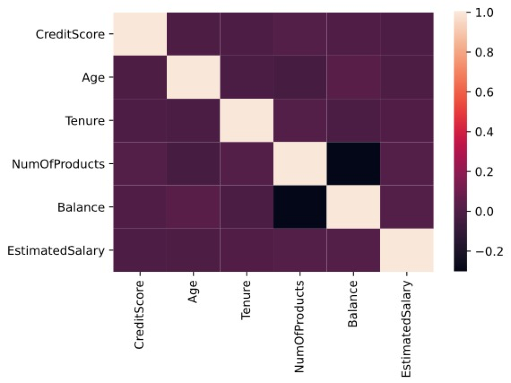

# Bank Customer Churn Prediction 
This project uses logistic regression, k-nearest neighbors, and random forest models to predict user churn in the banking industry. Among them, the hyperparameter tuning are performed by using grid-search.

## 1. Data Source

The data set of the project comes from the kaggle website. The data set contains 14 features and 10,000 rows of data. 

- Use the link below to visit the data source:

  [Predicting Churn for Bank Customers](https://www.kaggle.com/adammaus/predicting-churn-for-bank-customers)

## 2. Data Exploration

- boxplot of numerical features

- countplot of categorical features

- correlations between features

* Use link below to check more details of data explaration:
  [Data Exploration](churn-predict.ipynb)

## 3. Model Training and Result Evaluation

### 3.1 Logistic Regression

### 3.2 K-Nearest Neighbors

### 3.3 Random Forest
